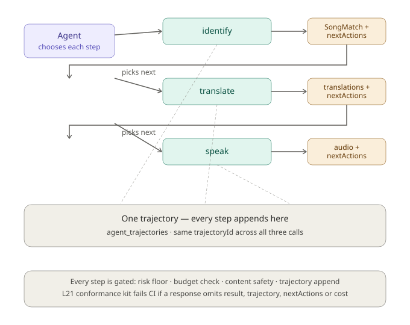
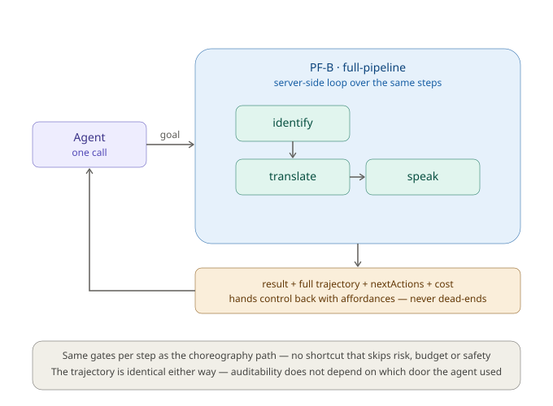

# AUX Design: Agent User Experience

> "Being agentic is not just about agents running on your platform — it's about agents running your platform."
> — Dharmesh Shah, simple.ai@dharmesh

**Status:** Design — Phase 5 Sprint 3b
**Target:** Phase 5 (Application Framework + AUX)
**Supersedes:** the April 2026 draft, which described AUX as a wrapper over the Phase 3 voice pipeline. This rewrite anchors AUX on the Phase 5 application framework and agent runtime, which did not exist when the first draft was written.
**Dependencies:** app-framework (ADR-028), agentic workflow framework (ADR-029), action identity & lifecycle (ADR-031), durable stores (TASK-075a, verified)
**Feeds:** ADR-030 (Agent User Experience)
**Last Updated:** 2026-08-14

---

## What changed since the April draft

The first AUX_DESIGN predates most of Phase 5 and describes a world that no longer holds:

- It framed `process-content` as wrapping Playform's routes (`/api/process`, `/api/tts`, `/api/extract`) directly. Since then the work has split: the **agent contract and workflow orchestration are platform (PF) work**; the **provider calls stay in Playform's voice module** where they already live. The old draft conflated the two.
- It described the surface over the Phase 3 `VoicePipeline`. Phase 4 and 5 added the agent runtime, durable trajectories, the action lifecycle protocol, and the app-framework session model. AUX now sits over those, not over the voice pipeline alone.
- It listed `nextActions` and per-step dollar cost as unbuilt. The provider layer already emits `estimatedCostUsd` per call and threads `trajectoryId`/`stepIndex` through every request and result — the gap is that the human routes discard those fields at the boundary, not that they don't exist.

This document is the reconciled design. ADR-030 records the decisions it reaches.

---

## The problem

Playform exposes human-facing endpoints. An agent handling a voice interaction must chain them by hand:

| Step | Endpoint             | Agent burden                                                     |
| ---- | -------------------- | ---------------------------------------------------------------- |
| 1    | `POST /api/extract`  | Route file types, handle encoding, retry on failure              |
| 2    | `POST /api/identify` | Know to call this for audio; parse the match result              |
| 3    | `POST /api/process`  | Parse a flat JSON blob designed for React                        |
| 4    | `POST /api/tts`      | Know to call this after processing, with the right language code |

That is three-to-four calls, token-burning orchestration reasoning, and per-step error handling — for one interaction. The platform already knows this workflow internally. The API surface still forces agents through the human path.

---

## Design principles

### 1. Workflow-level tools, not granular endpoints

An agent should express a goal — "identify this hum, translate the song title to Spanish, and speak it" — not orchestrate four endpoints. One tool per complete workflow.

### 2. Two intent layers, named apart

There are two distinct notions the April draft called by one name. They must stay separate, because ADR-030 and every downstream contract depend on the distinction.

- **`goal`** — the _workflow_ the agent wants accomplished. Request-level. Examples: `translate-and-speak`, `identify-song`, `full-pipeline`. This is the field on the agent request.
- **`intent`** — the _step-level_ semantic already carried by the provider layer (`IDENTIFY_INTENT = "inform"`, and the voice pipeline's `STEP_INTENT_MAP`). Per-step. This is not renamed; it is what the existing providers already emit.

`goal` names what the agent asked for. `intent` annotates what each internal step is doing. The rename of the request field from `intent` to `goal` is the one breaking change this design introduces, and it exists precisely so the two layers never collide in code or in an agent's reasoning.

### 3. Choreography is the primitive; orchestration is a convenience over it

This is the load-bearing decision. The platform supports two ways to run a workflow, and they are the **same machinery**, not two implementations.

**Choreography — the agent walks the steps.** Each step returns its result plus `nextActions`, and the agent chooses the next hop. The platform enumerates possibilities; the agent does not reason them out. This is what makes the system agent-centric rather than a script with an LLM attached, and it is what the demo's story — "nextActions visibly driving the next step" — shows.



**Orchestration — one call runs the loop server-side.** A `full-pipeline` goal runs the identical step sequence internally, against the same trajectory, applying the same gates, and returns the final result plus the complete `nextActions` and trajectory. It is the loop run to completion instead of across round trips — for a batch job or a latency-sensitive caller that does not want to walk steps.



Three invariants make this a single design rather than two:

1. **One workflow definition, two entry points.** The step sequence lives in one place (PF-B). `full-pipeline` calls the loop; the stepwise goals expose its checkpoints. A capability added to the loop appears in both automatically — no drift.
2. **The trajectory is identical either way.** Whether the agent made four calls or one, `agent_trajectories` shows the same steps. Auditability does not depend on which door the agent used.
3. **`nextActions` is always present**, including on the orchestrated return. A completed `full-pipeline` still hands back affordances (`translate-more`, `respond`, `done`); it never dead-ends. That is the difference between an agent API and an RPC.

**The rule that keeps it honest:** the orchestrated path must not skip the gates. Same risk floor per step, same budget check per step, same content-safety screening on the new input surface (Standing Rule 11), same trajectory append per step. A `full-pipeline` that bypassed any gate "for speed" would create two safety regimes, and the fast one would be the unsafe one — the shape of the swallowed-throw defect (ADR-032). The response-conformance kit enforces this: both entry points must emit `result + trajectory + nextActions + cost`, and the trajectory must show every gated step, or CI fails.

### 4. Cost transparency

Agents operate on budgets. Every response includes cost so agents can make economic decisions. The data already exists — `IdentifyResult.estimatedCostUsd`, and `agent_trajectories.total_cost` shaped `{usd, tokens, apiCalls}`. AUX stops discarding it and sums per-step cost into a `CostSummary`.

### 5. Trajectory as first-class return

Every workflow execution returns its trajectory (P18). Agents audit what happened, resume from failure points, and learn which workflows succeed. This is now backed by the durable Supabase trajectory store (TASK-075a), not an in-memory store that vanishes per request.

---

## The PF-B / Playform-A boundary

AUX is built in two layers, in two repos, in order.

**PF-B (platform, built first)** — the agent contract and the workflow orchestration:

- Agent-native contracts over app-framework sessions and agent workflows: `goal` + `nextActions`.
- The workflow loop: sequence the steps, mint and thread the trajectory, apply the gates, assemble `nextActions`, sum `CostSummary`.
- `GET /api/agent/capabilities` — discovery, so an agent self-configures.
- The gating contract — how a held action (ADR-031) is expressed to an agent caller.

**Playform-A (consumer, built second)** — the endpoint that exposes the workflow:

- `POST /api/agent/process-content` wrapping extract → identify → process → tts.
- The demo surface.

The provider calls themselves — `ACRCloudIdentifier`, the translation and TTS providers — already live in Playform's `platform/voice` module and are not rebuilt. The A-layer endpoint stops _discarding_ what they emit; it does not re-implement them.

**Worked example — `/api/identify` today.** The route runs auth, rate-limiting, format conversion, provider selection, and structured logging, then returns `{matched, match, confidence, clipDurationSeconds, remaining}` — dropping the `estimatedCostUsd`, `latencyMs`, and `trajectoryId` the provider already produced. The AUX layer wraps the same pipeline and keeps those fields. The provider resolves to a single `SongMatch | null` (no candidate list; `matched: false` is a normal result, not an error — P11), so the `nextActions` branch is binary: matched → offer `translate`/`speak`; not matched → offer `retry`/`done`.

---

## Proposed AUX surface

### Core types

```typescript
interface AgentResponse<T> {
  result: T;
  trajectory: Trajectory; // the kernel type; identified by trajectoryId, never id
  nextActions: readonly NextAction[]; // what the agent can do next
  cost: CostSummary; // so the agent can budget
}

interface NextAction {
  action: string; // "translate" | "speak" | "respond" | "retry" | "done"
  description: string; // human-readable, for debugging
  endpoint: string | null; // where to call; null for terminal actions
  requiredParams: string[];
  estimatedCostUSD: number; // numeric so an agent can sum it against its ceiling
}

interface CostSummary {
  apiCalls: number;
  tokensUsed: number;
  estimatedCostUSD: number;
  cachedResults: number;
  costSavedFromCache: number;
}
```

### `POST /api/agent/process-content`

The primary workflow tool. Replaces chaining `/api/extract` → `/api/identify` → `/api/process` → `/api/tts`.

```typescript
interface ProcessContentRequest {
  input: {
    audio?: string; // Base64 audio — including a hum, for song-ID
    text?: string;
    file?: string; // Base64 (PDF, etc.)
    url?: string;
  };

  // Workflow-level goal (design principle 2) — NOT the step-level `intent`
  goal:
    | "identify-song" // hum/clip → SongMatch (choreography primitive)
    | "translate" // → translations (choreography primitive)
    | "transcribe" // STT only (choreography primitive)
    | "speak" // text → audio (choreography primitive)
    | "translate-and-speak" // compose translate → speak
    | "full-pipeline" // identify → translate → speak, orchestrated
    | "analyze"; // read-only: classify + safety, no side effects

  targetLanguages?: string[];
  synthesize?: boolean;
  sourceLanguage?: string;

  // Agent context (P15)
  actorType: "agent" | "user" | "system";
  actorId: string;
  onBehalfOf?: string;
  traceId?: string;
  budgetMaxUSD?: number;
}

interface ProcessContentResponse {
  result: {
    song?: SongMatch | null; // for identify-song / full-pipeline
    transcript?: string;
    detectedLanguage?: string;
    contentType?: string;
    translations?: FanOutTranslation[];
    audio?: { [languageCode: string]: string };
    safety?: { passed: boolean; reason?: string };
  };
  trajectory: Trajectory; // totalLatencyMs is derived by the loop from Step.durationMs
  nextActions: NextAction[];
  cost: CostSummary;
}
```

The demo path is `full-pipeline` over `input.audio`: a hum is identified, the title translated, the result spoken — one call, one trajectory, `nextActions` handed back. The same demo can instead be walked as choreography (`identify-song`, then the returned `translate` action, then the returned `speak` action) to show the affordance chain explicitly.

### `GET /api/agent/capabilities`

Discovery. Lets a new agent self-configure — the enumerated `goal`s, their params, cost and latency ranges, language list, limits, and the resolved provider names. Feeds off the same registry and health probes the platform already runs.

### Deferred to later sprints (recorded, not dropped)

- `POST /api/agent/respond` — AI response in the context of a prior trajectory.
- `POST /api/agent/batch` — N items in one call.
- MCP server exposing AUX goals as MCP tools (Phase 8) — an explicit option, not a commitment.

---

## Evaluation criteria — enforced, not reviewed

The April draft listed these as review questions. In this design they are a **runtime response-conformance gate** (L21): a conformance kit asserts every `/api/agent/*` response on the way out, and CI fails if any response is missing a required field.

| #   | Gate        | Assertion                                                                                          |
| --- | ----------- | -------------------------------------------------------------------------------------------------- |
| 1   | One-call    | The complete workflow finishes in one call for orchestrated goals                                  |
| 2   | NextActions | `nextActions` is present and non-empty (terminal actions included)                                 |
| 3   | Cost        | `cost` is present with a numeric `estimatedCostUSD`                                                |
| 4   | Trajectory  | `trajectory.trajectoryId` resolves to a durable record with a step per gated action                |
| 5   | Capability  | The goal is discoverable via `/api/agent/capabilities`                                             |
| 6   | Gate parity | The trajectory of a `full-pipeline` run shows the same gated steps as the choreographed equivalent |
| 7   | Budget      | A `budgetMaxUSD` ceiling is respected and reported                                                 |

Gate 6 is the one that keeps orchestration honest: it proves the two entry points are the same machinery by comparing their trajectories, not their code.

---

## GenAI 18-Principle Mapping — Sprint 3b (L12 pre-code gate)

> Mapped before any Sprint 3b code (L12). Role legend: **Core** = Sprint 3b primary deliverer · **Extend** = fabric continued from a prior phase · **Advance** = moves a partial forward · **—** = no Sprint 3b deliverable.
>
> This table is a stub for ADR-030 to complete. The rows below are the load-bearing ones; ADR-030 fills the remainder and records the final mapping.

| #   | Principle             | Sprint 3b | How                                                                                                                |
| --- | --------------------- | --------- | ------------------------------------------------------------------------------------------------------------------ |
| 1   | Intent-Driven         | **Core**  | `goal` is the request; `nextActions` enumerates affordances — the agent selects, does not reason out possibilities |
| 2   | Agentic Execution     | **Core**  | The workflow loop is bounded, instrumented, and interruptible; choreography exposes its checkpoints                |
| 3   | Total Observability   | Extend    | Every step appends a trajectory Step; the durable store (TASK-075a) makes it survive the request                   |
| 6   | Structured Outputs    | **Core**  | `AgentResponse<T>` schema-validated on the way out by the L21 conformance gate                                     |
| 10  | Human Oversight       | Extend    | Held actions (ADR-031) expressed to the agent caller via the gating contract                                       |
| 12  | Economic Transparency | Advance   | Per-step `estimatedCostUsd` summed into `CostSummary`; `budgetMaxUSD` ceiling respected                            |
| 17  | Cognition-Commitment  | Extend    | The gating contract carries ADR-031's propose→commit boundary to the agent surface                                 |
| 18  | Durable Trajectories  | **Core**  | Trajectory is a first-class return, backed by the durable store                                                    |

_Remaining principles (4, 5, 7, 8, 9, 11, 13, 14, 15, 16) to be completed in ADR-030. 18/18 must be accounted for before code (L12)._

---

## Migration path

**Sprint 3b — this sprint:**

- PF-B: workflow loop, `goal` + `nextActions` contracts, `/api/agent/capabilities`, the gating contract, the L21 response-conformance kit.
- Playform-A: `/api/agent/process-content`, the demo surface.
- TASK-075b closes: an agent invoked over HTTP writes a trajectory a later request reads back.

**Later:**

- `/api/agent/respond`, `/api/agent/batch`.
- Deprecate direct agent use of `/api/process`, `/api/tts`, `/api/extract` (kept for the human UI).
- Phase 8: MCP server, agent discovery, multi-agent handoff via trajectories.

---

## What already exists

| Component                                  | AUX ready? | Gap                                                     |
| ------------------------------------------ | ---------- | ------------------------------------------------------- |
| Voice providers (identify, translate, tts) | Yes        | Emit cost + trajectory fields the human routes discard  |
| Durable trajectory store                   | Yes        | Verified live (TASK-075a)                               |
| Agent identity (P15)                       | Yes        | `actorType`/`actorId`/`onBehalfOf` on provider requests |
| Trajectory threading (P18)                 | Yes        | `trajectoryId`/`stepIndex` on request and result        |
| Action lifecycle / gating (ADR-031)        | Yes        | Needs an agent-facing expression — the gating contract  |
| `goal` + workflow loop                     | No         | PF-B, this sprint                                       |
| `nextActions` assembly                     | No         | PF-B, this sprint                                       |
| `/api/agent/capabilities`                  | No         | PF-B, this sprint                                       |
| Response-conformance kit                   | No         | PF-B, this sprint (L21)                                 |
| `/api/agent/process-content`               | No         | Playform-A, this sprint                                 |

---

_This document is reviewed at every phase boundary (L9)._
_See [ENGINEERING_LEARNINGS.md](ENGINEERING_LEARNINGS.md) for L13 (AUX design principle) and L21 (conformance kits)._
_See [PHASE5_PLAN.md](PHASE5_PLAN.md) for the sprint plan and [ROADMAP.md](ROADMAP.md) for the timeline._

_Last updated: August 14, 2026 (Sprint 3b — full rewrite onto the app-framework; goal/intent split; choreography-primitive/orchestration-convenience model; L21 response-conformance gate; two path diagrams added)_
