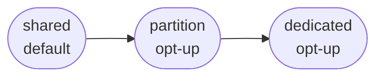
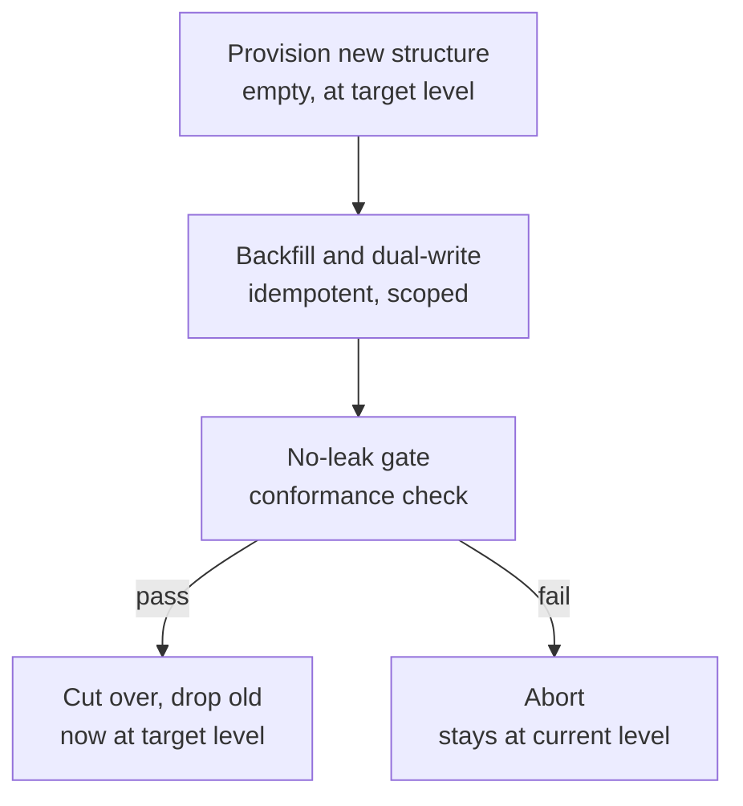
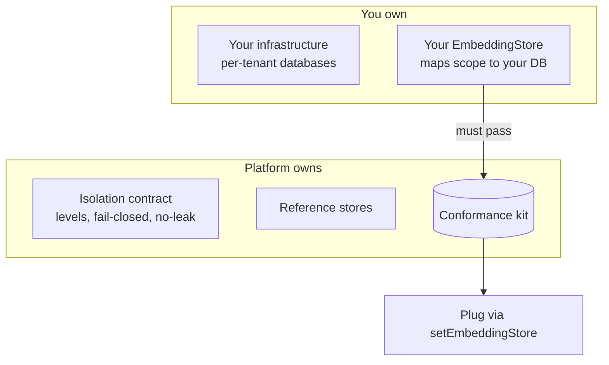

# Knowledge bases: an adopter's guide

This guide is for anyone building on Platform Foundation who wants to give their application its own
**knowledge bases** — bodies of app-owned content that a model retrieves from and grounds its
answers in — and to do it safely across many tenants. It explains the model, the contract, and how to
adopt at every level, from a one-line declaration to plugging in your own storage.

The authoritative decision record is [ADR-042](adr/ADR-042-app-specific-rag.md); its companion
[ADR-043](adr/ADR-043-ugc-input-screening.md) covers input-surface screening. This guide is the
_how_ and the _why_; the ADRs are the _what_.

---

## 1. The problem, plainly

A knowledge base is easy to build for one tenant and hard to run for a hundred. The moment two
tenants' content shares a retrieval system, the central question is not accuracy — it is **isolation**:
tenant A must never retrieve tenant B's knowledge. Get that wrong once and it is a data-disclosure
incident, not a bug.

So the platform treats isolation as a **structural, fail-closed property you cannot forget to apply**
— never a filter a caller remembers to pass — and it does so **without tying the decision to any
particular database**. You choose _how strong_ isolation should be; the platform guarantees it holds.

## 2. The model: three isolation levels

Every knowledge base declares an `IsolationLevel`. It names a _strength_, not a mechanism:

- **`shared`** — the default. Knowledge lives in shared storage, but every read is confined to its
  scope by the storage layer itself, structurally — not by an application filter.
- **`partition`** — an opt-up. Each knowledge base gets its own partition within the shared system:
  independent, faster for large bases, cleaner to operate.
- **`dedicated`** — an opt-up. Fully separate storage per knowledge base: isolation by construction,
  the strongest posture, at higher cost.

You start at `shared` and **opt up** when a tenant's compliance or scale demands it. You never opt
_out_ of safety.

## 3. The contract (this is the part that matters)

Whatever the level, three guarantees hold — and they are store-agnostic:

1. **Scope is a first-class object of named dimensions, resolved from verified context.** Every
   operation carries a `scope` — the knowledge base plus the named `dimensions` its boundary
   requires (`tenant`, `region`, and so on) — derived from a verified session or membership lookup,
   never a value the caller passes in. A KB declares its boundary dimensions once; you cannot query
   without them, and a missing one returns nothing. New boundaries are added by declaring a dimension
   — the contract does not change.
2. **No scope, no results (fail-closed).** A query without an authorized scope returns nothing. A
   store or provider error degrades to no-context generation, not a leak and not a crash.
3. **No result ever crosses a scope boundary**, at any level.

That is the whole contract. It says nothing about how a store achieves it — which is exactly why you
can bring your own store (§6).

## 4. Adopting — level 1: declare a knowledge base

The common case. Register a knowledge base, declaring its level; push content; retrieve. No
infrastructure work.

- Register: `{ id, isolationLevel: "shared", boundary: ["tenant"], embeddingModel }` (level defaults to
  `shared` if omitted).
- Ingest: push documents. The platform chunks, screens the input
  ([ADR-043](adr/ADR-043-ugc-input-screening.md)), embeds, and stores under the KB's scope.
- Retrieve: issue a query against the scoped handle; results are injected into the generation call's
  context alongside per-user memory, within budget.

Your ingest and retrieve code is **identical at every level** — only the declared level differs.

## 5. Adopting — level 2: opt up a live knowledge base

Raising a knowledge base that already holds content (`shared` to `dedicated`, say) is **not a flag
flip** — it is a governed, online migration the platform runs for you, and it never opens an unscoped
window:

Reads keep hitting the old structure until the no-leak gate passes; if it fails, the migration aborts
and the knowledge base simply stays where it was. Two rules of direction:

- **Raising** strength (weaker to stronger) is allowed and audited.
- **Lowering** strength weakens the posture, so it goes through **two-person approval** (dual-control,
  [ADR-040](adr/ADR-040-held-action-dual-control-admin.md)) and is audited — some deployments forbid
  it outright.

`dedicated` and `partition` have real cost and object-count ceilings, so they are quota-gated. That
is _why_ `shared` is the default and the stronger levels are deliberate choices.

## 6. Adopting — level 3: bring your own store

If you need isolation beyond what the reference stores offer — most often **separate database
instances** per tenant for a hard compliance boundary — you do **not** fork the platform. You plug in
a store, the same way any provider is swapped:

1. **Stand up your infrastructure** — a database per tenant, or whatever your compliance requires.
   This is yours; the platform cannot provision database instances on your behalf.
2. **Implement `EmbeddingStore`** so that a `scope` maps to that scope's own database. This lives in
   _your_ repo. Declare which levels your store supports.
3. **Pass the isolation conformance kit** — no cross-scope leak, fail-closed on missing scope, level
   honoured. The platform trusts your store only once it passes.
4. **Register it** (`setEmbeddingStore`) and **declare** `dedicated` (or your custom level) on the
   relevant knowledge bases.

Your application code — ingest, retrieve — does not change. Only the store underneath differs. That
is the entire payoff of a store-agnostic contract: the strictest isolation is "implement one
interface and pass one kit," not "modify the platform."

## 7. Who owns what

| The platform owns                                                | You own                                                   |
| ---------------------------------------------------------------- | --------------------------------------------------------- |
| The isolation contract (levels, fail-closed scoping, no-leak)    | Your infrastructure                                       |
| The reference stores (up to `dedicated` = separate schema/index) | A store implementation, _only if_ you need more than that |
| The conformance kit every store must pass                        | Declaring each KB's level                                 |

## 8. Why it is built this way

A few deliberate choices, so the design reads as intentional rather than incidental:

- **Isolation is structural, not a filter.** Industry experience is consistent: an application-layer
  "remember to filter by tenant" is a single point of failure — one missed filter is a leak. The
  boundary belongs below the application, enforced so that even a forgotten filter returns nothing.
- **The decision is store-agnostic; the mechanism is conformance evidence.** Row-level security,
  namespaces, separate schemas — these are how a _given_ store passes the kit, not what the platform
  decides. This keeps adopters free to bring any store and keeps the contract honest.
- **Safe by default, opt up deliberately.** `shared` is safe on day one; stronger isolation is a
  declared, governed, migrated choice. Nobody has to opt out of a leak, and nobody pays for
  separate-store overhead they do not need.
- **Trust is earned by the kit.** No store — ours or yours — is trusted because someone read its
  code. It is trusted because it passes the same behavioural no-leak tests. That is the ADR-027
  provider pattern applied to isolation.

## 9. What the conformance kit proves

For every registered store, at each level it claims to support: no cross-scope leakage; fail-closed
on a missing or unauthorized scope; the declared level is honoured; an opt-up migration preserves
no-leak and aborts fail-closed with no unscoped window; an unsupported level is refused, never
silently downgraded. Passing the kit is the definition of "trusted" — for the reference stores and
for yours alike.
