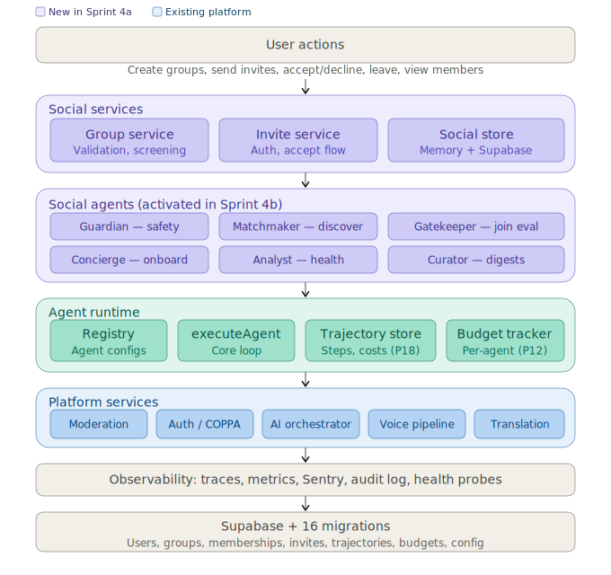

# Platform Architecture

> Living document. Updated at phase and sprint boundaries when layers change.

---

## Overview

This document collects the platform's architectural views. Each phase adds new diagrams as layers are built. For the full roadmap, see [ROADMAP.md](ROADMAP.md).

---

## Social and agent runtime layers (Phase 4, Sprint 4a)

**Legend:**
- **Purple** — New in Sprint 4a (social services, social agents, agent runtime)
- **Teal** — New in Sprint 4a (agent runtime infrastructure)
- **Blue** — Existing platform services (Phases 1–3)
- **Gray** — Shared infrastructure (observability, data layer)

---

## Layer Descriptions

### User actions
All user-facing operations flow through typed service interfaces. Users create groups, send and respond to invitations, manage memberships, and view group members. No direct database access — every operation goes through the service layer.

### Social services
Business logic for group lifecycle and invitation management. GroupService enforces validation (name length, description limits), content screening via Guardian hook, and ownership checks. InviteService enforces authorization (inviter must be a member, invitee must not be, only the invitee can accept/decline) and coordinates the accept-to-add-member flow. SocialStore is provider-aware (P7) — in-memory for tests, Supabase for production.

### Social agents
Six autonomous AI agents that operate on the social fabric. Each agent has a defined job, specific triggers, and runs as a bounded workflow through the agent runtime. Agents are *registered* in Sprint 4a but *activated* in Sprint 4b. See [AGENT_ARCHITECTURE.md](AGENT_ARCHITECTURE.md) for full agent design.

| Agent | Job | Key principle |
|---|---|---|
| Guardian | Content safety on all social surfaces | P4 structural safety, P17 fail-closed |
| Matchmaker | Group recommendations | P14 feedback loops, P11 fallback |
| Gatekeeper | Join request evaluation | P10 human oversight, P6 structured output |
| Concierge | Onboarding new members | P15 agent identity, P16 cognitive memory |
| Analyst | Group health metrics | P12 economic transparency, P18 trajectories |
| Curator | Content digests | P8 context/memory, P11 degradation |

### Agent runtime
Execution infrastructure for all agents. Registry stores agent configurations. `executeAgent()` is the core loop: check budget → run workflow step → record in trajectory store → repeat until done or budget exhausted. Budget tracker enforces per-agent per-scope cost limits (P12). Trajectory store persists every step for inspection and replay (P18).

### Platform services
Existing services built in Phases 1–3: content moderation (multi-layer: blocklist → classifier → Guardian), authentication with COPPA enforcement, LLM orchestration with provider abstraction, voice pipeline (STT → safety → translate → TTS), and translation with 10-language support. All services are provider-aware (P7) and environment-variable swappable.

### Observability
Cross-cutting fabric (ADR-014): distributed traces, metrics sink (in-memory + Supabase), Sentry error reporting, moderation audit log, and health probes for every external dependency.

### Data layer
Supabase (PostgreSQL) with 16 migrations covering: identity and access (001–009), content safety (010–014), social data model (015), and agent runtime (016). Row-level security on all tables. Service-role bypass for server-side agent operations.

---

## Related Documents

- [AGENT_ARCHITECTURE.md](AGENT_ARCHITECTURE.md) — Full agent design (clusters, sequences, inter-agent communication)
- [GENAI_MANIFESTO.md](GENAI_MANIFESTO.md) — 18 principles governing all AI behavior
- [GENAI_ROADMAP.md](GENAI_ROADMAP.md) — Phased delivery of GenAI capabilities
- [ROADMAP.md](ROADMAP.md) — 10-phase platform roadmap
- [ADR-021](adr/ADR-021-social-system-architecture.md) — Social System Architecture
- [ADR-022](adr/ADR-022-agent-runtime-architecture.md) — Agent Runtime Architecture

---

_Last updated: April 29, 2026 (Sprint 4a — social data model + agent runtime)_
