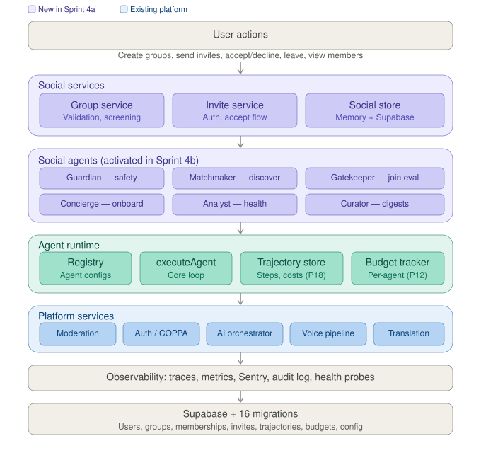

# Platform Architecture

> Living document. Updated at phase and sprint boundaries when layers change.

---

## Overview

This document collects the platform's architectural views. Each phase adds new diagrams as layers are built. For the full roadmap, see [ROADMAP.md](ROADMAP.md).

---

## Social and agent runtime layers (Phase 4, Sprint 4a)

**Legend:**

- **Purple** — New in Sprint 4a (social services, social agents, agent runtime)
- **Teal** — New in Sprint 4a (agent runtime infrastructure)
- **Blue** — Existing platform services (Phases 1–3)
- **Gray** — Shared infrastructure (observability, data layer)

---

## Layer Descriptions

### User actions

All user-facing operations flow through typed service interfaces. Users create groups, send and respond to invitations, manage memberships, and view group members. No direct database access — every operation goes through the service layer.

### Social services

Business logic for group lifecycle and invitation management. GroupService enforces validation (name length, description limits), content screening via Guardian hook, and ownership checks. InviteService enforces authorization (inviter must be a member, invitee must not be, only the invitee can accept/decline) and coordinates the accept-to-add-member flow. SocialStore is provider-aware (P7) — in-memory for tests, Supabase for production.

### Social agents

Six autonomous AI agents that operate on the social fabric. Each agent has a defined job, specific triggers, and runs as a bounded workflow through the agent runtime. Agents are _registered_ in Sprint 4a but _activated_ in Sprint 4b. See [AGENT_ARCHITECTURE.md](AGENT_ARCHITECTURE.md) for full agent design.

| Agent      | Job                                   | Key principle                               |
| ---------- | ------------------------------------- | ------------------------------------------- |
| Guardian   | Content safety on all social surfaces | P4 structural safety, P17 fail-closed       |
| Matchmaker | Group recommendations                 | P14 feedback loops, P11 fallback            |
| Gatekeeper | Join request evaluation               | P10 human oversight, P6 structured output   |
| Concierge  | Onboarding new members                | P15 agent identity, P16 cognitive memory    |
| Analyst    | Group health metrics                  | P12 economic transparency, P18 trajectories |
| Curator    | Content digests                       | P8 context/memory, P11 degradation          |

### Agent runtime

Execution infrastructure for all agents. Registry stores agent configurations. `executeAgent()` is the core loop: check budget → run workflow step → record in trajectory store → repeat until done or budget exhausted. Budget tracker enforces per-agent per-scope cost limits (P12). Trajectory store persists every step for inspection and replay (P18).

### Platform services

Existing services built in Phases 1–3: content moderation (multi-layer: blocklist → classifier → Guardian), authentication with COPPA enforcement, LLM orchestration with provider abstraction, voice pipeline (STT → safety → translate → TTS), and translation with 10-language support. All services are provider-aware (P7) and environment-variable swappable.

### Observability

Cross-cutting fabric (ADR-014): distributed traces, metrics sink (in-memory + Supabase), Sentry error reporting, moderation audit log, and health probes for every external dependency.

### Data layer

Supabase (PostgreSQL) with 16 migrations covering: identity and access (001–009), content safety (010–014), social data model (015), and agent runtime (016). Row-level security on all tables. Service-role bypass for server-side agent operations.

---

## Phase 5 — Application framework & governed agency

Phase 5 turns the agent runtime (registered in Phase 4) into a governed, resumable application
framework, and puts every agent action under attested, admin-governed authority.

### Application & agentic-workflow framework (ADR-028/029/031)

Agent work runs as a **durable, resumable workflow**: trajectories, budgets, proposals, and
external effects are persisted (not fire-and-forget). Tool invocation routes through the
governed action pipeline, so a restricted tool is gated by the same code that gates a
restricted session action. Gated actions are **held rather than refused**, with approval
reconciled against the exact version the approver saw, then **resumed**. Rollback appends
compensating actions; history is never rewritten. Failure is three-valued — an external effect
that neither confirmed nor denied propagates as `indeterminate`, never collapsed into
success or failure.

### Governed authority (ADR-033/034/035)

Every agent-invoked capability passes a **two-principal check** — the user's gate (session +
account status + per-account feature restriction) and the agent's gate (a governed trusted-agent
registry). Agent identity is **attested delegation** (rung 2): a short-lived RS256 token minted
through an OAuth 2.1 / PKCE consent flow, bound to the delegating user and a specific scope; the
old `x-agent-role` header trust is retired. All of this — the registry, the capability→feature
map, the approval policy, per-account blocks — is administered through the **GenAI-native
governance admin** (prompt → AI plan → human confirm → execute), a reusable, vocabulary-free
platform capability inherited by any consumer with agents.

See [AGENT_ARCHITECTURE.md](AGENT_ARCHITECTURE.md) (the "Governed authority" section) for the
full design, and [MIGRATION_v1_to_v2.md](MIGRATION_v1_to_v2.md) for the one breaking change the
rung-2 identity introduced.

## Related Documents

- [AGENT_ARCHITECTURE.md](AGENT_ARCHITECTURE.md) — Full agent design (clusters, sequences, inter-agent communication)
- [GENAI_MANIFESTO.md](GENAI_MANIFESTO.md) — 18 principles governing all AI behavior
- [GENAI_ROADMAP.md](GENAI_ROADMAP.md) — Phased delivery of GenAI capabilities
- [SETUP_AND_INTEGRATION.md](SETUP_AND_INTEGRATION.md) — how a consumer adopts and syncs
- [ENV_REFERENCE.md](ENV_REFERENCE.md) — every environment variable
- [AGENT_DELEGATION_GUIDE.md](AGENT_DELEGATION_GUIDE.md) — building agents on the platform
- [ROADMAP.md](ROADMAP.md) — 10-phase platform roadmap
- [ADR-021](adr/ADR-021-social-system-architecture.md) — Social System Architecture
- [ADR-022](adr/ADR-022-agent-runtime-architecture.md) — Agent Runtime Architecture

---

_Last reviewed: September 2026 (v2.0.0 — Phase 5 application framework & governed agency)_
