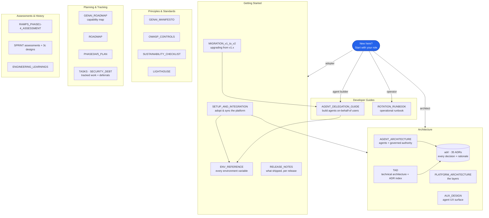

# Documentation

The map and index for everything under `docs/`. New here? Jump to your role below. Every
document is catalogued in [The full catalog](#the-full-catalog) with a one-line description.

> This index is kept honest by a test: `__tests__/docs-integrity.test.ts` fails if any document
> under `docs/` is not listed here, so a new doc cannot be added without a map entry.

## Start by your role

- **Adopting the platform** → [SETUP_AND_INTEGRATION](SETUP_AND_INTEGRATION.md), then
  [ENV_REFERENCE](ENV_REFERENCE.md).
- **Upgrading from v1.x** → [MIGRATION_v1_to_v2](MIGRATION_v1_to_v2.md).
- **Building agents** → [AGENT_DELEGATION_GUIDE](AGENT_DELEGATION_GUIDE.md) +
  [AGENT_ARCHITECTURE](AGENT_ARCHITECTURE.md).
- **Understanding the architecture** → [TAD](TAD.md) →
  [PLATFORM_ARCHITECTURE](PLATFORM_ARCHITECTURE.md) → [adr/](adr/).
- **Operating it** → [ROTATION_RUNBOOK](ROTATION_RUNBOOK.md), [SECURITY_DEBT](SECURITY_DEBT.md).
- **What shipped** → [RELEASE_NOTES](RELEASE_NOTES.md), [GENAI_ROADMAP](GENAI_ROADMAP.md).

## Map

## The full catalog

### Getting Started

| Doc                                                  | What it is                                                                              |
| ---------------------------------------------------- | --------------------------------------------------------------------------------------- |
| [SETUP_AND_INTEGRATION.md](SETUP_AND_INTEGRATION.md) | Adopt the platform: zero-config boot → real backends → migrations → sync/inheritance.   |
| [ENV_REFERENCE.md](ENV_REFERENCE.md)                 | Every environment variable — purpose, required, default, values, incl. delegation keys. |
| [MIGRATION_v1_to_v2.md](MIGRATION_v1_to_v2.md)       | Upgrading from v1.x: the breaking rung-1 retirement + adoption steps.                   |
| [RELEASE_NOTES.md](RELEASE_NOTES.md)                 | What shipped, per release, newest first.                                                |

### Architecture

| Doc                                                  | What it is                                                                 |
| ---------------------------------------------------- | -------------------------------------------------------------------------- |
| [TAD.md](TAD.md)                                     | Technical Architecture Document — stack, layers, API inventory, ADR index. |
| [PLATFORM_ARCHITECTURE.md](PLATFORM_ARCHITECTURE.md) | The platform layers and how they compose.                                  |
| [AGENT_ARCHITECTURE.md](AGENT_ARCHITECTURE.md)       | Agent clusters, workflow, and the governed-authority layer.                |
| [AUX_DESIGN.md](AUX_DESIGN.md)                       | The agent user-experience surface.                                         |
| [adr/](adr/)                                         | 35 Architecture Decision Records — every decision and its rationale.       |

### Developer Guides

| Doc                                                    | What it is                                                                               |
| ------------------------------------------------------ | ---------------------------------------------------------------------------------------- |
| [AGENT_DELEGATION_GUIDE.md](AGENT_DELEGATION_GUIDE.md) | Build agents that act on a user's behalf (PKCE flow, token lifetime, failure reference). |
| [ROTATION_RUNBOOK.md](ROTATION_RUNBOOK.md)             | Operational runbook for key/secret rotation.                                             |

### Principles & Standards

| Doc                                                                | What it is                                            |
| ------------------------------------------------------------------ | ----------------------------------------------------- |
| [GENAI_MANIFESTO.md](GENAI_MANIFESTO.md)                           | The GenAI-native principles the platform is built on. |
| [OWASP_CONTROLS.md](OWASP_CONTROLS.md)                             | OWASP Top 10 control mapping.                         |
| [SUSTAINABILITY_CHECKLIST.md](SUSTAINABILITY_CHECKLIST.md)         | Sustainability review checklist.                      |
| [SUSTAINABILITY_REVIEW_PROMPT.md](SUSTAINABILITY_REVIEW_PROMPT.md) | The prompt used for sustainability reviews.           |
| [LIGHTHOUSE.md](LIGHTHOUSE.md)                                     | Lighthouse performance/accessibility guidance.        |

### Planning & Tracking

| Doc                                  | What it is                                                          |
| ------------------------------------ | ------------------------------------------------------------------- |
| [GENAI_ROADMAP.md](GENAI_ROADMAP.md) | The capability map — accomplished and forthcoming.                  |
| [ROADMAP.md](ROADMAP.md)             | High-level roadmap.                                                 |
| [PHASE3_PLAN.md](PHASE3_PLAN.md)     | Phase 3 plan.                                                       |
| [PHASE4_PLAN.md](PHASE4_PLAN.md)     | Phase 4 plan.                                                       |
| [PHASE5_PLAN.md](PHASE5_PLAN.md)     | Phase 5 plan (current phase).                                       |
| [TASKS.md](TASKS.md)                 | Task register — non-security functional work + deferrals.           |
| [SECURITY_DEBT.md](SECURITY_DEBT.md) | Consciously deferred security items, each with a plan and deadline. |

### Assessments & History

| Doc                                                                                          | What it is                                    |
| -------------------------------------------------------------------------------------------- | --------------------------------------------- |
| [RAMPS_PHASE1_ASSESSMENT.md](RAMPS_PHASE1_ASSESSMENT.md)                                     | RAMPS assessment — Phase 1.                   |
| [RAMPS_PHASE2_ASSESSMENT.md](RAMPS_PHASE2_ASSESSMENT.md)                                     | RAMPS assessment — Phase 2.                   |
| [RAMPS_PHASE3_ASSESSMENT.md](RAMPS_PHASE3_ASSESSMENT.md)                                     | RAMPS assessment — Phase 3.                   |
| [RAMPS_PHASE4_ASSESSMENT.md](RAMPS_PHASE4_ASSESSMENT.md)                                     | RAMPS assessment — Phase 4.                   |
| [SPRINT2_ASSESSMENT.md](SPRINT2_ASSESSMENT.md)                                               | Sprint 2 assessment.                          |
| [SPRINT3C_D_IDENTITY_RUNG2_DESIGN.md](SPRINT3C_D_IDENTITY_RUNG2_DESIGN.md)                   | Sprint 3c D — agent identity rung 2 design.   |
| [SPRINT3C_F_PER_ACCOUNT_RESTRICTION_DESIGN.md](SPRINT3C_F_PER_ACCOUNT_RESTRICTION_DESIGN.md) | Sprint 3c F — per-account restriction design. |
| [SPRINT3C_UX_GOVERNANCE_ADMIN_DESIGN.md](SPRINT3C_UX_GOVERNANCE_ADMIN_DESIGN.md)             | Sprint 3c UX — governance admin design.       |
| [ENGINEERING_LEARNINGS.md](ENGINEERING_LEARNINGS.md)                                         | Accumulated engineering lessons.              |

---

_This index is guarded by `__tests__/docs-integrity.test.ts`: every `.md` under `docs/` must
appear here, and the required adopter docs must exist. Add a doc, add its row._
