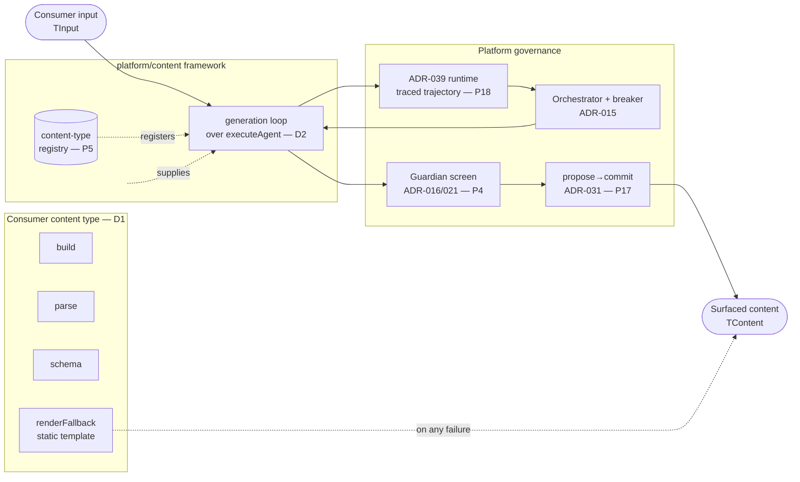
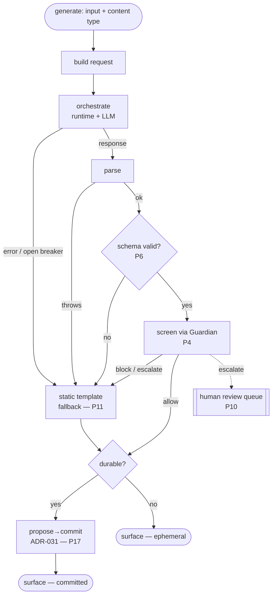
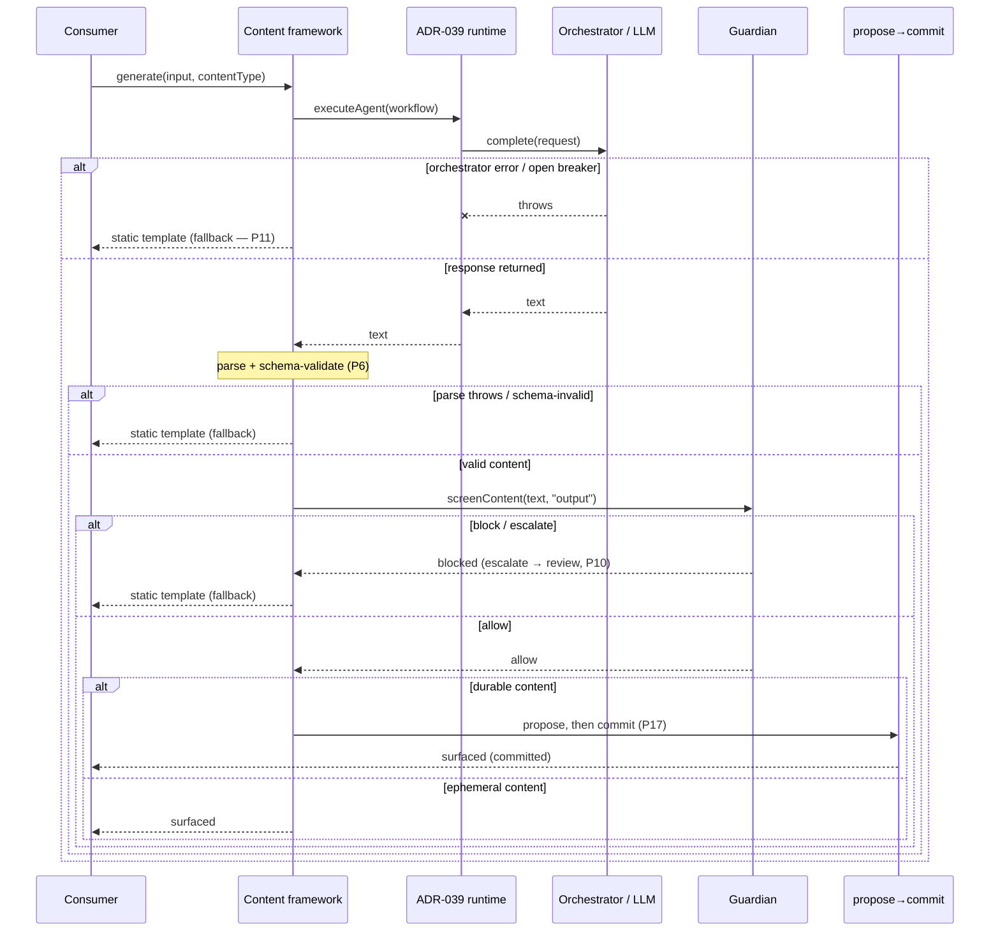

# ADR-037 — Dynamic content generation framework

**Status:** Accepted
**Date:** 2026-09-17
**Spec basis:** ADR-028 (application framework — D1 consumer-implements), ADR-015 (prompt
registry), ADR-016 / ADR-021 (Guardian content screening), ADR-031 (propose→commit boundary),
ADR-039 (agent runtime), ADR-038 (eval harness), ADR-036 (adaptive behavior — the sibling seam).

## 1. The end state

A consumer defines a **content type** — `build` / `parse` / `schema` / `renderFallback` for its
own `TInput` / `TContent` — and the platform owns the generation loop: it runs generation as a
traced trajectory on the ADR-039 runtime, validates the output against the consumer's schema,
**screens it through the Guardian before it can surface** (P4), and falls back to the consumer's
**static template** on any failure. Content that becomes a durable, user-visible artifact surfaces
through the propose→commit boundary (ADR-031), held until committed. No app logic lives in the
framework; no generation, screening, or surfacing governance lives in the consumer.

The Curator digest is the reference content type — and bringing it under the framework closes a
live gap: today `createCuratorWorkflow` generates a digest and returns it **unscreened**.

## 2. Decisions

**D1 — Consumer-implements seam.** The consumer supplies `build` / `parse` / `schema` /
`renderFallback`; the framework owns generation, validation, screening, and surfacing. Same seam as
ADR-036 D1.

**D2 — Runs on the ADR-039 runtime.** Each generation executes inside `executeAgent` as a
`WorkflowFn` — a traced, budgeted, cost-attributed trajectory (P2/P3/P12/P18). No second execution
path.

**D3 — The deterministic fallback is a mandatory static template.** Fail-closed (P11) on
orchestrator error, open breaker, parse failure, schema-invalid output — **and on a Guardian block
or escalate.** The platform refuses to register a content type without `renderFallback`. A model
outage or an unsafe generation degrades to deterministic, pre-screened content; it never stalls and
never surfaces unvalidated or unscreened content.

**D4 — Generated content is screened before it can surface (the distinct decision).** The framework
calls `screenContent(text, { direction: "output", … })` (Guardian, ADR-016/021) on every generated
block. A `block` or `escalate` never surfaces — the framework returns the static-template fallback,
and an `escalate` feeds the human review queue (P10). Screening is **framework-forced, not consumer
discipline** — structural safety (P4), the content analog of ADR-036 D4's forced boundary.

**D5 — Durable content surfaces via propose→commit (ADR-031).** Generating is cognition (internal,
revisable); surfacing durable content is commitment (audited) — the P17 boundary. Content that
persists is proposed (held), screened, and surfaces only on commit; it is an ordinary governed
effect, with no privileged route. Ephemeral content (rendered once, not persisted) is still screened
but need not be proposed.

**D6 — Eval-gated and schema-conforming.** Every content prompt ships an ADR-038 eval suite (P9);
the meta-test fails the build for an unevaluated prompt. Output is validated against the consumer's
JSON schema with a fail-closed / self-healing parse (P6).

**D7 — No within-session memory.** Unlike ADR-036 D5, content is generated fresh from current input;
the framework carries no memory slice. Cross-session or accumulating content context, if ever
needed, is a later, separately-governed decision.

## 3. Generation flow — normal and exception paths

The loop has one normal path and four failure classes, all of which converge on the consumer's
static template so a runtime failure can never yield a missing, unvalidated, or unscreened result.

The static template is authored, deterministic content — safe by construction — so it is not
re-screened; it still crosses propose→commit when the content is durable.

## 4. Alternatives considered

**Relationship to the adaptive framework.**

- **(a) A separate `platform/content` framework mirroring the adaptive shape — CHOSEN.** _For:_ the
  output governance genuinely differs (screen + propose/commit vs the action-pipeline's risk
  gating), so a shared abstraction would be forced into union types and mode-branching; ADR-036 is
  shipped and stable, so mirroring its proven shape beats churning it; each conformance kit stays
  single-purpose. _Against:_ some duplicated scaffolding (registry, bootstrap, conformance-kit
  skeleton) — the "same seam" is a pattern parallel, not shared code.
- **(b) Generalize ADR-036 into one framework with two output modes — REJECTED.** _For:_ maximal
  reuse, one mental model. _Against:_ one abstraction straddling a scalar-routed-through-gating and a
  block-screened-and-held tends to a leaky, branchy core, and retrofitting a stable component is
  churn for its own sake.

**Screening placement.**

- **(a) Framework-forced screening before any content can surface — CHOSEN.** _For:_ "no unscreened
  content surfaces" becomes structural (P4), not a convention each consumer must remember — exactly
  the gap the current Curator demonstrates. _Against:_ one screening call on every generation's
  output path.
- **(b) Leave screening to the consumer / screen at display time — REJECTED.** _For:_ fewer
  framework steps. _Against:_ reopens the gap — an unscreened block can reach a user; safety becomes
  discipline.

**Fallback form.**

- **(a) A consumer-supplied static template — CHOSEN.** _For:_ deterministic, already-safe content
  correct for _this_ content type. _Against:_ the consumer must author a template, not just a prompt.
- **(b) A generic platform default — REJECTED.** _For:_ nothing for the consumer to write.
  _Against:_ a generic default can't be correct for an arbitrary `TContent`, and a missing fallback
  is precisely when an outage would surface as a blank or a stall.

**Surfacing model.**

- **(a) Screen always; propose→commit for durable content — CHOSEN.** _For:_ content inherits the
  same commitment governance every other durable effect has (P17). _Against:_ durable content takes
  a propose then a commit rather than a single write.
- **(b) Generate and show immediately, screen asynchronously — REJECTED.** _Against:_ a window where
  unscreened content is visible — unacceptable for a safety surface.

**Within-session memory (the D7 decision).**

- **(a) Omit memory — CHOSEN.** Content is a pure function of current input; no session slice to
  build, persist, or bound.
- **(b) Carry a memory slice like adaptive — REJECTED for now.** Unneeded complexity and a lifecycle
  to get right for no current requirement.

## 5. How we get there — implementation sequencing

1. `ContentType` types + registry + the mandatory-fallback registration guard.
2. The generation loop over `executeAgent` (build → orchestrate → parse → schema-validate → screen →
   fallback), no memory.
3. Durable surfacing through the existing propose→commit path (ADR-031); ephemeral surfacing =
   screen-then-return.
4. Bring **Curator** under the framework as the reference content type — add output screening
   (closing the gap); its `CURATOR_EVAL` already exists.
5. The L21 conformance kit (`__tests__/contract/content-type-contract.ts`).

Each step a small, green commit, validated the usual way.

## 6. Invariants

- No content surfaces unscreened (P4). A `block` / `escalate` yields the static template.
- Every generation is a traced trajectory (P18); every content prompt has an eval suite (P9).
- A model or screening failure yields the static template — never a stall, blank, or unscreened
  output (P11).
- Durable content crosses the commitment boundary via propose→commit (P17); the framework has no
  direct-surface path for it.

## 7. Conformance kit (L21)

`__tests__/contract/content-type-contract.ts` (invoked per registered content type): registration
is rejected without a fallback; an orchestrator error, an open breaker, a parse failure, a
schema-invalid output, and a **Guardian block** each yield the static template; generated content is
observed on the screening path before it surfaces (never a direct surface); durable content routes
through propose→commit; and the type's prompt has an eval suite (cross-checked against ADR-038's
`EVAL_SUITES`). A coverage self-test keeps the invoked set in lockstep with the registry.

## 8. RAMPS / governing-principles mapping

- **Reliability:** fail-closed to static templates (P11); traced, replayable trajectories (P18);
  Continuous Confidence — the conformance kit runs per content type inside the standard gate.
- **Accessibility (WCAG 2.2):** the framework emits **structured, typed content** (schema'd fields),
  never markup, so consumers render it into accessible components and announce dynamic surfacing via
  `aria-live` (SUSTAINABILITY A6). Accessibility is a consumer-render property; the framework never
  injects inaccessible output.
- **Manageability:** content types and templates are versioned registry artifacts (P5); one
  registration / boot path mirroring the adaptive bootstrap; `escalate` integrates the human review
  queue (P10).
- **Performance:** fast-tier default for frequent generation (P12); per-trajectory budget; screening
  is a single call on the output path.
- **Security (OWASP):** input sanitized before the prompt (`sanitizeForPrompt`, A03); Guardian
  screening on output (P4 structural safety); structured logging via `lib/logger` (A09); the
  unscreened-Curator gap is **closed here, not deferred** (Foundation as Fabric — no silent debt).
- **AAA:** generation runs under agent identity (P15, `actorType` / `actorId`); propose→commit and
  trajectories provide the audit trail (Analytics).

## 9. Related

ADR-028, ADR-015, ADR-016 / ADR-021 (Guardian), ADR-031 (propose→commit), ADR-039 (runtime),
ADR-038 (evals), ADR-036 (sibling adaptive seam), ADR-040 (dual-control). Consumed by Sprint-7
Playform adoption.

_Last updated: September 17, 2026 (Phase 5 Sprint 4 — ADR-037 authored in full after the Curator /
prompt-registry survey: separate content-generation framework (1a) mirroring the ADR-036 seam,
mandatory Guardian screening before surfacing (D4/P4), fail-closed to a consumer static template
(D3/P11), durable content via propose→commit (D5/P17), no within-session memory (D7); block / flow /
sequence diagrams for the normal and exception paths; RAMPS mapping included)._
