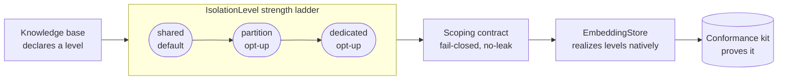

# ADR-042: Application-Specific RAG and Knowledge Bases

Status: Proposed (Phase 5 Sprint 5). Decision maker: Raman Sud.
Related: ADR-023 (Phase-4 RAG pipeline — EmbeddingProvider, chunker, retriever, budget-aware
context injector, per-user context store), ADR-027 (provider conformance-kit pattern — abstraction
trusted only once it passes a kit), ADR-043 (UGC input-surface screening), ADR-035 (governance
admin), ADR-040 (held-action / dual-control), ADR-015 (GenAI-native stack). `platform/rag/`.

---

## 1. The end state

A consumer registers one or more **application-specific knowledge bases** — bodies of app-owned
content (rules, lore, docs, catalogs) — and relevant passages are retrieved and injected into a
generation call's context on the same governed runtime as every other model interaction. The
Phase-4 foundation already supplies embeddings, chunking, retrieval, a budget-aware injector, and a
per-user context store; Sprint 5 extends it from _per-user_ memory to _per-application_ knowledge:
the consumer supplies the content, the platform owns ingestion, retrieval, budgeting, injection —
and, above all, **isolation**. Because a third party will run this across many tenants, isolation is
not a filter a caller remembers to pass; it is a **structural, fail-closed property of the
abstraction**, proven by a conformance kit, and expressed with **no reference to any particular
store**.

## 2. Decisions

**D1 — Knowledge bases are a first-class registered abstraction.** A KB registry (globalThis-anchored
per ADR-032, registered at boot, mirroring the content-type and adaptive registries) maps a KB id to
its declared config: `{ name, isolationLevel, boundary, embeddingModel, ... }`. Registration is
the governed control-plane surface for a KB (P13).

**D2 — Isolation is a declared level, ordinal in strength, structural and fail-closed — store-agnostic.**
Each KB declares an `IsolationLevel`: `shared` then `partition` then `dedicated`. The level names a
_strength_, never a mechanism. **`shared` is the default**; `partition` and `dedicated` are declared
opt-ups. The decision records the level ladder and its guarantees, not how any store realizes them.

**D3 — Scope is a first-class object of named dimensions, resolved from verified context,
enforced at the store boundary, never a caller-supplied filter.** Every store operation takes a
`scope` — `{ knowledgeBaseId, dimensions: Record<string, string> }` — resolved from a verified
session / server-side membership, not a request value. Each KB declares its **boundary**: the named
dimensions that define its isolation (`[]` for platform-shared; `["tenant"]`; `["tenant", "region"]`;
and so on). The boundary is validated at entry — a declared dimension absent from the resolved
scope returns nothing (fail-closed). No result ever crosses a scope boundary, at any level. This —
declared level plus a declared, named-dimension boundary, enforced fail-closed and non-bypassable —
is the entire contract; it says nothing about _how_, and the dimension set is **extensible without
changing the contract, the stores, or the conformance kit**.

**D4 — The `EmbeddingStore` contract carries the scoping + isolation obligation; stores declare which
levels they support.** Each store realizes the levels in its own native mechanism and advertises its
supported set. Registering (or opting up) to an unsupported level **fails closed with a clear error**
— never a silent downgrade to weaker isolation. This is the ADR-027 pattern: the platform trusts a
store not by inspecting it but because it passes the kit (§4).

**D5 — Ingestion is consumer-pushed and content-versioned.** The consumer registers a KB and pushes
documents; the platform chunks, then **screens (ADR-043, input direction)**, then embeds, then
upserts under the KB's scope. Knowledge bases are content-versioned: a re-ingest supersedes by
version and stale vectors are reaped. Ingestion is designed here, not deferred.

**D6 — Retrieval takes a scoped handle and composes with per-user context.** Retrieval is issued
against a scoped KB handle (never a loose filter); results feed the existing budget-aware injector
alongside the per-user context store. On retrieval failure the turn **degrades to no-context
generation, not failure** (P11) — the retriever's existing fail-closed contract.

**D7 — Opt-up on a live KB is a governed, online, fail-closed migration.** Changing an existing KB's
level is not a flag flip; it is: provision the new structure (empty, at target level), backfill with
dual-write (idempotent), pass a **no-leak conformance gate**, cut over reads, drop the old structure.
Reads stay on the old structure until the gate passes, so there is never an unscoped window; a failed
gate aborts and the KB stays at its current level. **Raising** strength is allowed and audited;
**lowering** goes through dual-control (ADR-040). Every level change is a durable, audited trajectory
(P18).

**D8 — Deletion and erasure are explicit.** KB-level and per-document deletes cascade to their
vectors; right-to-erasure (GDPR) is a first-class path, and at `dedicated` it is a clean drop.

**D9 — Provenance is structured, not baked.** Every retrieval emits a full explanation chain — which
KB, which chunks, scores, why — as structured, semantic data (P3/P10/P18) so a consuming UI can
render it accessibly (see §5, WCAG).

## 3. Alternatives considered

**(a) One shared store scoped only by a metadata filter — rejected.** Filter-as-a-boundary is
fragile: a missed field or a wrapper that drops the filter is a cross-tenant leak. Metadata filtering
is retained only for _sub_-tenant, document-level RBAC, never as the tenant/KB boundary.

**(b) A store-specific decision (for example "use RLS") — rejected.** Baking a store's mechanism into
the decision couples the platform to one store and blocks a third party from bringing their own. The
mechanism is an implementation's conformance evidence (§6), not the decision.

**(c) Physical isolation (`dedicated`) as the default — rejected.** Separate schema/index per KB has
real cost and object-count ceilings; forcing it on every adopter is wasteful. It is a declared opt-up
for high-compliance tenants, not the floor.

**(d) A fixed access tier (`platform` / `tenant` / `user`) for the scope boundary — rejected in
favour of named dimensions.** A fixed enum is the simplest to validate but the least extensible: a new
boundary (organization, team, region, data-residency) forces a change to the core enum and every
validation site. A fixed hierarchy (an ordered ladder) adds levels but cannot express non-hierarchical
axes such as region. An opaque scope token with a consumer-supplied resolver is maximally flexible but
leaves the platform unable to reason about or prove the boundary shape, weakening the no-leak kit.
**Named dimensions** — a KB declares which named dimensions form its boundary, resolved from verified
context — is the chosen middle: the common case stays trivial (`["tenant"]`), a new axis is added by
declaring it (no core, store, or kit change), and the boundary stays a concrete tuple the conformance
kit can prove leak-free. Chosen for extensibility without surrendering provability — model the
boundary to the business, start simple, evolve.

## 4. Conformance (L21) — store-agnostic

One isolation conformance kit runs **every** registered store through the same behavioural tests, for
each level it claims: (1) no cross-scope leakage; (2) fail-closed on a missing or unauthorized scope;
(3) the declared level is honoured; (4) an opt-up migration preserves no-leak and aborts fail-closed
with no unscoped window; (5) an unsupported level is refused, not downgraded. A store — reference or
third-party — is trusted only once it passes. This is what makes the design sound regardless of
store.

## 5. GenAI / RAMPS / WCAG

- **GenAI tenets.** P4 (isolation _and_ input screening structural, unbypassable) · P8 (app knowledge
  as first-class governed memory) · P16 (resource memory atop the Phase-4 user-context store) ·
  P3/P10/P18 (retrieval fully traced, explainable, inspectable) · P12 (retrieval/embed budgeted per
  trajectory) · P13 (KBs are governed control-plane artifacts) · P5/P6 (versioned, typed) · P11
  (fail-closed to no-context). We demonstrate the manifesto, not merely satisfy it.
- **RAMPS.** Reliability (fail-closed plus the no-leak kit) · Security/OWASP (structural isolation,
  verified-context scope, input screening, PII/GDPR) · Manageability (governed KB registry, audited
  level changes) · Performance (budgeted, latency-traced, k6-able).
- **WCAG 2.2.** The KB-management admin surface (register / inspect / delete / change level) targets
  **AA, AAA where feasible**, mirroring the governance admin (ADR-035); retrieval provenance is
  emitted as structured data so a consuming UI renders it accessibly — called out now, not left to
  Sprint 7.

## 6. Consequences

- The consumer's ingest/retrieve code is identical at every isolation level; opt-up is a declaration
  plus a platform-owned migration, not a rewrite.
- A third party reaches the strictest isolation without forking: `dedicated` (separate schema/index)
  is a declaration on the reference store; separate _database instances_ are an "implement one
  `EmbeddingStore`, pass the kit" task in their own repo (see `docs/KNOWLEDGE_BASES.md`).
- **Reference-store evidence (not part of the decision).** The two shipped stores realize the ladder
  natively: the in-memory store by per-scope maps / separate instances; the Supabase/pgvector store
  by Row-Level Security with `FORCE ROW LEVEL SECURITY` and transaction-local, verified-context tenant
  scoping for `shared`, table partitioning + partial indexes for `partition`, and a separate schema /
  index for `dedicated`. These mechanisms are how those stores _pass the kit_ — they live in the
  implementations' notes, not here.
- Full decisions are settled in this ADR (no in-sprint TBD); implementation follows the pre-code
  survey already recorded for `platform/rag/`.
