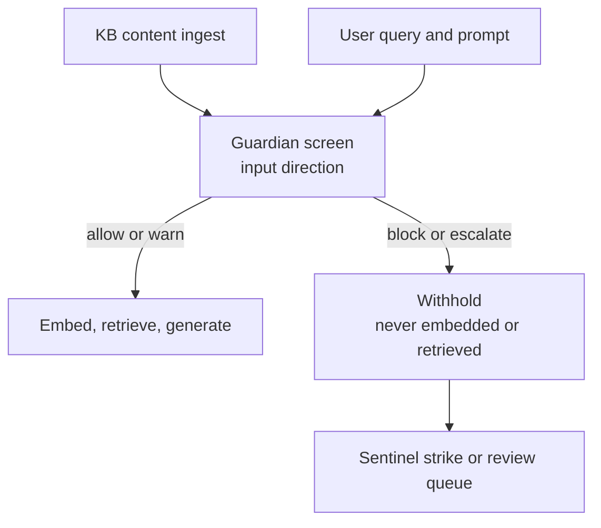

# ADR-043: User-Generated-Content Input-Surface Screening

Status: Accepted (Phase 5 Sprint 5). Decision maker: Raman Sud.
Related: ADR-016 / ADR-017 (content-safety architecture, moderation pipeline), ADR-021 (Guardian),
ADR-039 (Guardian on the runtime — fail-closed to `escalate`), ADR-041 (escalation SLA), ADR-024
(human review queue), ADR-042 (application-specific RAG). `platform/moderation/middleware.ts`.
Governs: **Standing Rule 11** — no input surface ships unscreened.

---

## 1. The end state

Every **user-generated input** that reaches a model — the input surface opened by
application-specific RAG (ADR-042) and by consumer-supplied prompts — passes through the Guardian
**before** it is embedded, retrieved against, or sent to a model, exactly as generated output is
screened before it surfaces (Sprint 4, ADR-037 D4). Standing Rule 11 says no input surface ships
unscreened; Sprint 5 makes that structural for the input direction: screening is **on the path, not
the caller's responsibility**, and fails closed. The mechanism already exists — `screenContent(text,
{ direction })` — so this ADR is about making the input direction a first-class, unavoidable contract,
not about new machinery.

## 2. Decisions

**D1 — Input screening is structural, not opt-in.** Every user-supplied text that will reach an
embedding model or a generation call is screened by the Guardian first. The platform's own
ingestion and retrieval paths perform the screen; a consumer cannot reach the model with unscreened
input, in the same way they cannot surface unscreened output. This is Standing Rule 11 made
enforceable, not advisory.

**D2 — The seam is the existing `screenContent(text, { direction: "input" })`; the input direction
becomes first-class.** Input carries its own screening `contentType` (distinct from generation) so
policy, telemetry, and thresholds can target user input specifically. No parallel screening path is
created (ADR-016/017 remain the one pipeline).

**D3 — Two enforcement points, both structural: ingest and query.** Knowledge-base content is
screened at **ingestion**, before it is chunked and embedded (a poisoned document never enters the
index — OWASP LLM data-poisoning). A user's retrieval query and prompt are screened at **query
time**, before embedding or generation (prompt injection at the boundary — OWASP LLM prompt
injection). Both are performed by the framework, not the caller.

**D4 — Block and escalate are fail-closed and route to existing governance.** A `block` withholds the
input — it is never embedded, retrieved against, or sent — and, when attributable, fires the Sentinel
strike ladder (ADR-039 wiring). An `escalate` (including the fail-closed default when the screener
itself errors, ADR-039) withholds the input and routes to the human review queue under the escalation
SLA (ADR-024 / ADR-041). A screener error never fails open.

**D5 — It composes with ADR-042 by wrapping its ingest and query paths.** The RAG framework calls the
screen internally at both points; ADR-042's ingestion (D5) and retrieval (D6) are the callers. Input
screening and knowledge-base isolation are independent structural guarantees that hold together.

**D6 — The contract is provider-agnostic.** The Guardian is the reference moderation provider behind
the `screenContent` middleware; a consumer may plug a different classifier provider, which is trusted
only once it passes the moderation conformance kit (ADR-027 pattern). The screening _obligation_ is
the decision; the classifier is an implementation.

## 3. Alternatives considered

**(a) Screen only at query time, trust ingested content — rejected.** A knowledge base is an input
surface; unscreened ingestion lets an adversary poison retrieval so that later, screened queries
still surface harmful grounded content. Both points must be screened.

**(b) Leave screening to the consumer at the call site — rejected.** That is the "remember to filter"
anti-pattern in a new place: one un-screened call is an unscreened surface. Screening must be
structural, performed by the framework.

**(c) A new input-only moderation path — rejected.** The existing `screenContent` pipeline already
carries a `direction`; a parallel path would duplicate policy and drift. We extend the one pipeline.

## 4. Conformance (L21)

The input-screening conformance kit asserts, structurally: (1) blocked input is never embedded,
retrieved against, or sent to a model; (2) a screener error fails closed to `escalate`, never allow;
(3) both enforcement points — ingest and query — screen (an ingest path that skips the screen fails
the kit); (4) block routes to Sentinel when attributable and escalate routes to the review queue.
This runs against any classifier provider plugged behind the middleware.

## 5. GenAI / RAMPS / WCAG

- **GenAI tenets.** P4 (input safety structural and unbypassable) · P10 (block/escalate route to human
  oversight) · P3/P18 (every screen verdict traced and inspectable) · P13 (screening thresholds are
  governed control-plane config) · P11 (fail-closed).
- **RAMPS.** Security/OWASP (prompt injection at query, data-poisoning at ingest — screened at the
  boundary) · Reliability (fail-closed to escalate) · Manageability (one governed pipeline, input
  thresholds targetable) · Performance (screen cost tracked per trajectory).
- **WCAG 2.2.** A withheld input returns a clear, structured reason (not a bare failure) so a
  consuming UI can present it accessibly (AA); the review-queue admin inherits the governance admin's
  AA/AAA posture (ADR-035).

## 6. Consequences

- Consumers get input safety for free: the RAG and prompt paths screen without a call-site opt-in.
- A poisoned document cannot enter a knowledge base, and an injected prompt cannot reach the model —
  the two OWASP-LLM input risks are closed structurally, at both surfaces.
- Screening remains one pipeline (ADR-016/017); this ADR adds the input direction as a first-class,
  enforced contract, not new machinery.
